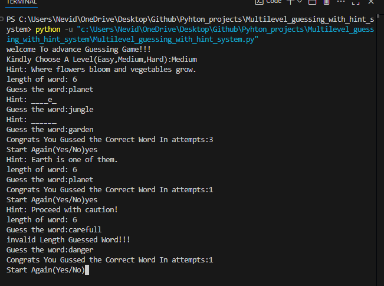

# 🎮 Advanced Guessing Game (Python)

Welcome to the **Advanced Word Guessing Game**!  
Test your brain and vocabulary skills by guessing words based on clever hints across three difficulty levels.

---

## 🚀 How to Play

1. **Choose a Level**: Easy, Medium, or Hard  
2. **Get a Hint**: A short clue will be shown  
3. **Guess the Word**: Type your guess — match the exact length  
4. **Get Feedback**: Correct letters in correct positions will be shown  
5. **Repeat** until you win or give up 😄

---

## 🧠 Game Features

- ✅ 3 Difficulty Levels: Easy / Medium / Hard  
- 🔠 Word length hint provided  
- 🔁 Play again without restarting the script  
- 🚫 Prevents wrong-length guesses to avoid errors  
- 🎯 Tracks number of attempts

---

## 💻 Run It Locally

> Python 3.x is required.

```bash
# Clone the repo
git clone https://github.com/your-username/guessing-game.git

# Navigate to the folder
cd guessing-game

# Run the script
python guessing_game.py
<h3>Play it online(No login)</h3>
<a href="https://replit.com/@mdnabid786/Multilevelguessingwithhintsystem">Play</a>
<h1>Example:</h1>

